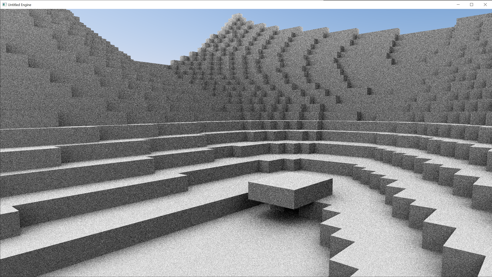

# Untitled - DXR Voxel Game
This is a small project to learn about DXR raytracing.

# Current Feature-Set
- DX12 (DXR) Raytracing pipeline
- 100% raytraced, no rasterization
- Runtime creation and destruction of voxel blocks within a 64x64x64 chunk
- Simple sky model based on the [Preetham analytical model for daylight](https://www.cs.utah.edu/~shirley/papers/sunsky/sunsky.pdf)

# Planned Features
- Denoising
- Path traced global illumination

# Raytraced AO of a voxel chunk at 8 samples per pixel

# Resources used during development
- [Introduction to DirectX RayTracing ](http://intro-to-dxr.cwyman.org/)
- [IntroToDXR](https://github.com/acmarrs/IntroToDXR)
- [DirectX Graphics Samples](https://github.com/Microsoft/DirectX-Graphics-Samples)

# Libraries and Dependencies
- [D3D12MA](https://github.com/GPUOpen-LibrariesAndSDKs/D3D12MemoryAllocator)
- [DXC](https://github.com/microsoft/DirectXShaderCompiler)
- [EASTL](https://github.com/electronicarts/EASTL)
- [FastNoiseSIMD](https://github.com/Auburns/FastNoiseSIMD)
